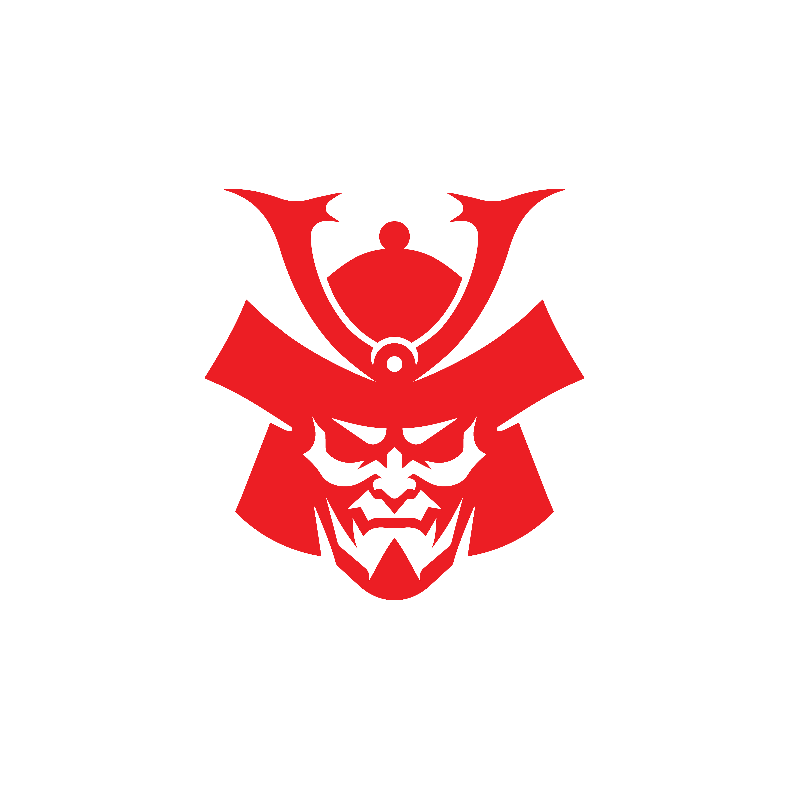

# Bushido NFT

Bushido NFT is an experimental storytelling project where a limited collection of on-chain samurai grants holders the ability to steer an animated series. Votes are weighted by rarity, letting the community decide how the saga unfolds.

## Lore Snapshot

*Excerpt from the project lore:* An ambitious entrepreneur discovers an artifact that maps a hidden valley. When he activates it he is hurled into 16th‑century Japan, where eight clans exemplifying Bushido must resist his malevolent doppelgänger.

## Repository Guide

- **[Architecture](Architecture.md)** – directory breakdown of contracts, backend and frontend.
- **[Complete Tech Stack](CompleteTechStack.md)** – frameworks and infrastructure used.
- **[Lore Overview](docs/Lore.md)** – summary of the anime narrative.

## Quick Start

1. Clone the repository
2. Install dependencies with `pnpm install`
3. Copy `.env.example` to `.env` and fill in RPC_URL, CONTRACT_ADDRESS, and other values
4. Deploy contracts via `pnpm deploy`
5. Start the backend API with `pnpm --filter backend dev`
6. Launch the frontend with `pnpm --filter frontend dev`

## Voting Mechanics

Rarity determines a holder's voting power:

- Common: 1 vote
- Uncommon: 4 votes
- Rare: 9 votes
- Epic: 16 votes
- Legendary: 25 votes

## Sample Characters

Below are a few samurai NFTs that can serve as story protagonists:

## Episode Schedule

Episodes release weekly with a 48‑hour voting window for key decisions.

## Connect

- Website: [bushido.xyz]
- Twitter: [@BushidoNFT]
- Discord: [Join our community]

